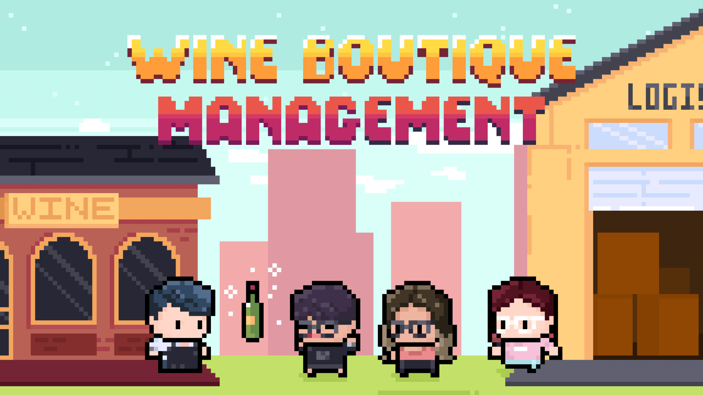

# Wine Boutique Management

## Description

In the game, you will play the role as an owner of a wine boutique. Feel free to manage your inventory and decide when to order. Remember to prepare enough inventory for the surge demand before the festival period and try your best to fulfill customer demand. 
Hope you enjoy the game!

## Table of Contents

- [Getting Started](#getting-started)
  - [Prerequisites](#prerequisites)
  - [Installation](#installation)
- [Usage](#usage)
- [Game Page](#game-page)
- [License](#license)
- [Acknowledgments](#acknowledgments)

## Getting Started

Please install Dbeaver for connecting the online database for recording your score.

### Prerequisites

Please install the latest version of Dbeaver and R

### Installations
Dbeaver [24.1.3]

R [4.1.1]

## Usage

The game is based on one year period, so it consists of 52 weeks per round. In some weeks, we add in some surge demand period such as Christmas and Chinese New Year to enhance the reality and playability, so please be prepared in advance to satisfy customer demand. However, in the game, another challenge is to balnace the transportation cost and holding cost, so you have to consider carefully and decide order quantity, transportation method and when to place your order. The final goal of the game is to optimize the cash balance at week 53. You can see your rank in the "Leaderboard" Tab. By the way. there are some hints and key information in the "Info" Tab, please read through it before starting the game for the higher rank!!

## Game Page

-Introduction: Here is the description and background of the game.  

-Game: Just click "Start" when you are ready. Let's go!  

-Info: Highly encourage to read through this tab. There are many key information here.  

-Chart: As the game going, you can see your cost and revenue chart here then utilize it for the future operation.  

-Leaderboard: Check your rank here!  

[Introduction](Login.png)
[Game](png)
[Info](Info.gif)
[Chart](png)
[Leaderboard](Leaderboard.png)

## Main Code
Please click the [link](main code.R) for the main code, however, due to the connection with AWS, the game is unplayable.

## License

The project is licensed under the [MIT License](LICENSE).

## Acknowledgements

I would like to extend my sincere gratitude to everyone who played a role in bringing [Wine Boutique MAnagement] to life. This project has been a labor of love, and your support and assistance have been invaluable.

### Team Members

First and foremost, I want to express my appreciation to my dedicated team members who worked tirelessly on this project. Your unwavering commitment, creativity, and collaboration were the driving force behind the game's success. Thank you for your hard work and dedication.

### Mentors and Instructors

I am deeply thankful to our mentors and instructors at [Engineering System and Design] pillar, particularly those in our MSO and ESA classes. Your guidance, expertise, and insightful feedback played a crucial role in shaping this project. Your dedication to our growth and learning are greatly appreciated.

### Testing and Feedback

I am grateful to all the individuals who participated in testing the game and providing valuable feedback. Your input helped us refine and improve [Wine Boutique Management] to make it the best it could be.

### Community and Users

Last but not least, I want to thank our wonderful gaming community and users. Your enthusiasm, engagement, and valuable feedback have been instrumental in the evolution of [Wine Boutique Management]. We created this game with you in mind, and your enjoyment of it is our greatest reward.

The development of [Wine Boutique Management] has been an incredible experience, and I look forward to future updates and enhancements. Your continued support is invaluable, and I can't wait to see where this journey takes us.

Thank you all for being a part of this adventure!
